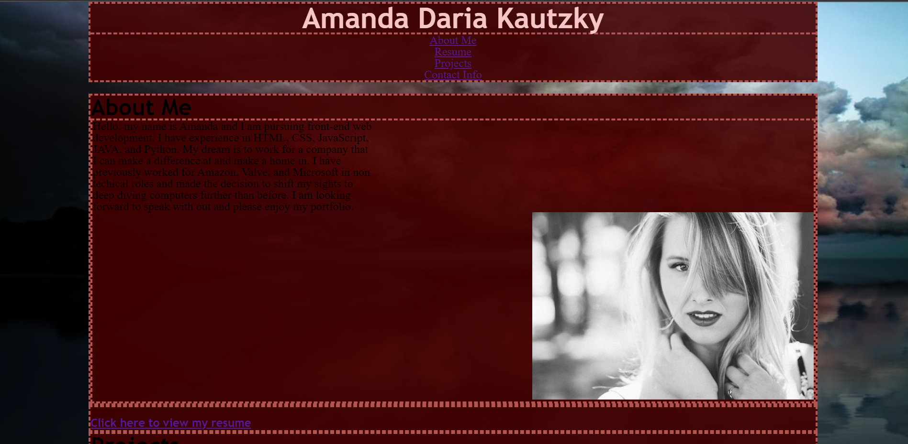
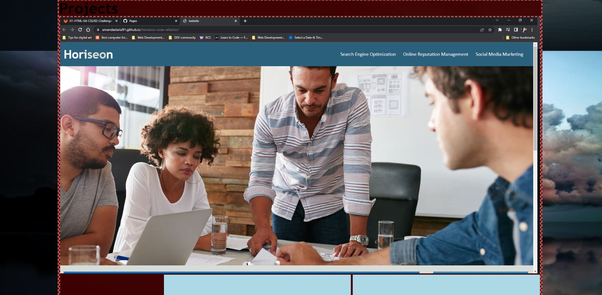
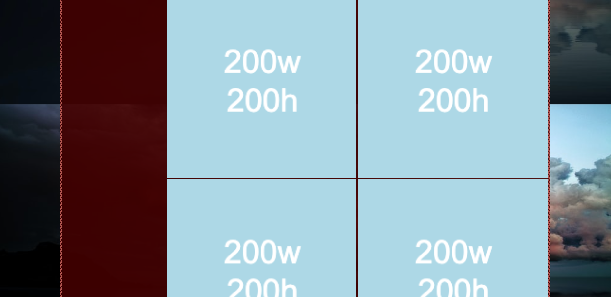
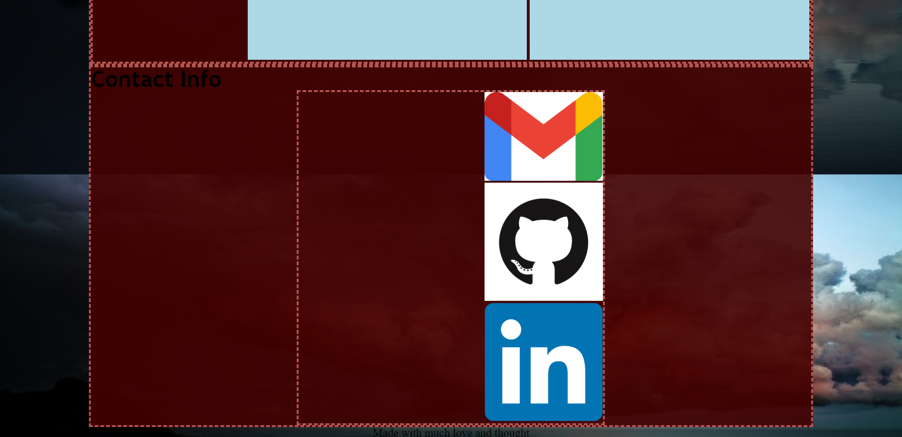

# amanda-daria-portfolio

## Description
My professional portfolio with samples of my work. This code I started from scratch and have been slowly building. It involves navigation scrolling to specific parts on the page, links with my work and resume, and information on how to contact me. 

- My motivation is to contune to showcase my work with this evolving webpage which will continue to update with the experience I gain.

- I built this project because it was my first challenge of starting from the beginning and working from the ground up.

- I learned a lot from this project especially the importance of working on layout before adding styling.

## Table of Contents

- [Installations](#installations)
- [Usage](#usage)
- [Credits](#credits)
- [License](#license)
- [Badges](#badges)

## Installation

No installation or authentication required to view the webpage or access the linked pages.

## Usage

[Link to deployed site](https://amandadaria91.github.io/amanda-daria-portfolio/)

## Credits

@UWA-Bootcamp and @FreeCodeCamp provided instruction into the foundational knowledge of HTML, CSS, and readMe. 

## License

I used an [MIT License](LICENSE).

## Badges

